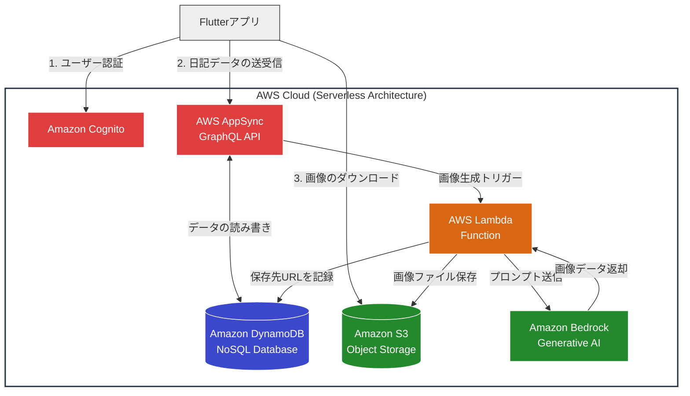

# AI Image Diary (AI画像分析日記)

## 📖 概要
撮影した写真をアップロードすると、AWSのAIが自動で「写っているもの（犬、海、料理など）」をタグ付けし、思い出を賢く整理できる日記アプリです。
第一希望の会社への入社を目指し、「AWS × Flutter」の実践的なポートフォリオとして開発しています。

## 🛠 使用技術

### モバイル (Flutter)
- **Framework:** Flutter (Dart)
- **State Management:** Riverpod (予定)

### バックエンド (AWS)
- **Auth:** Amazon Cognito (ユーザー認証)
- **Storage:** Amazon S3 (画像保存)
- **Database:** Amazon DynamoDB
- **AI:** Amazon Rekognition (画像分析)

## 🚀 今後の開発ロードマップ
- [ ] プロジェクトの立ち上げとドキュメント作成
- [ ] UI作成（ログイン画面）
- [ ] AWS Cognito連携
- [ ] S3への画像アップロード

## 🏗️ システム構成図 (System Architecture)

